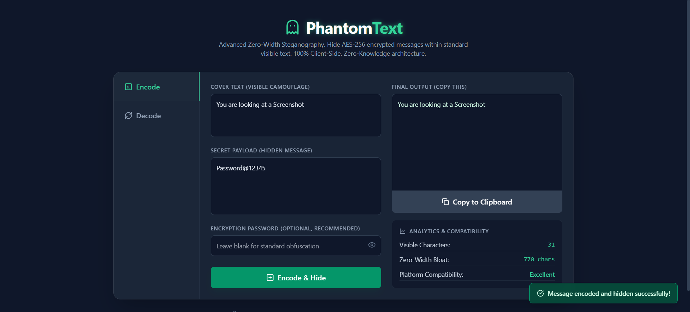
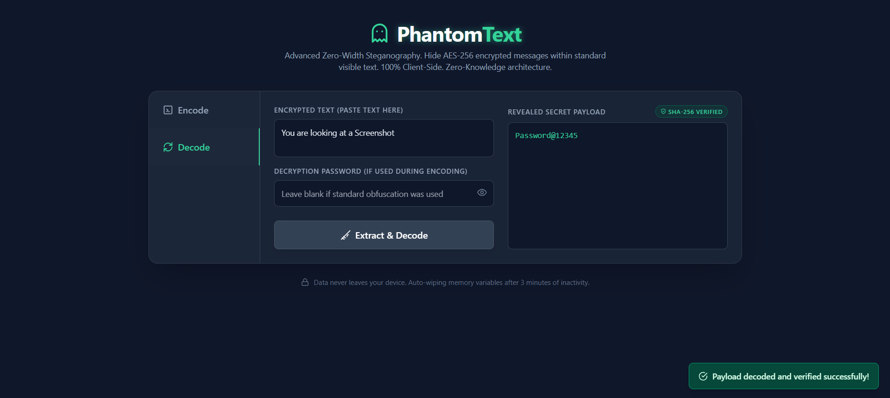

# 👻 PhantomText: Hidden Text Steganography 🔐

> Securely hide encrypted messages inside normal-looking text using zero-width Unicode characters.

[](https://Mayank-01x.github.io/hidden-text-steganography/)


<p align="center">
  
</p>
<p align="center"><b>Encoding Process (Hiding Secret Message)</b></p>

<p align="center">
  
</p>
<p align="center"><b>Decoding Process (Extracting Hidden Message)</b></p>

---

**PhantomText** is a fully client-side web application that combines **cryptography + steganography**. Unlike traditional encryption tools that produce obvious ciphertext, PhantomText ensures both absolute secrecy and visual invisibility.

---

## ✨ Key Features

- 🔍 **Zero-Width Steganography:** Invisible text embedding that visually matches standard text.
- 🔐 **Strong Encryption:** AES-256 encryption using the native Web Crypto API.
- 🧠 **Key Derivation:** PBKDF2 protects passwords against brute-force attacks.
- 📦 **Smart Compression:** Utilizes the Deflate API with an automatic LZW fallback for optimal payload size.
- 🛡️ **Tamper Detection:** SHA-256 integrity verification prevents malicious payload alteration.
- ⏱️ **Auto-Wipe Security:** Sensitive data and fields are automatically wiped after 3 minutes of inactivity.
- 📊 **Real-Time Analytics:** Tracks zero-width character bloat and assesses platform compatibility dynamically.
- ⚡ **100% Client-Side:** No data leaves the browser.

---

## ⚙️ How It Works

### Encoding Process
1. Secret message is converted into bytes and hashed via SHA-256 for integrity.
2. Data is compressed (Deflate or LZW) to minimize bloat.
3. Compressed data is encrypted using AES-GCM.
4. Ciphertext is converted into zero-width characters (`\u200B`, `\u200C`, `\u200D`).
5. Invisible characters are injected seamlessly into the visible cover text.

### Decoding Process
1. Zero-width characters are extracted from the cover text.
2. Binary is converted back to bytes and decrypted using the user's password.
3. Data is decompressed and integrity is verified against the original SHA-256 hash.
4. The original message is securely revealed.

---

## 🚀 Quick Start (Zero Installation)

PhantomText requires no Node.js, package managers, or server setup.

1. Clone or download the repository.
2. Simply open `index.html` in any modern web browser.
3. Start encoding and decoding!

---

## 🧠 Core Technologies

- **Frontend:** HTML5, CSS3, JavaScript, TailwindCSS
- **Security:** Web Crypto API (AES-GCM, PBKDF2, SHA-256)
- **Data Handling:** CompressionStream API, Custom LZW implementation
- **Steganography:** Unicode Zero-Width Characters

---

## 📁 Project Structure

```text
.
├── index.html   # Main application & logic
├── README.md    # Documentation
├── LICENSE      # MIT License
```
---

## 👨‍💻 Author

**Mayank Aggarwal**\
GitHub: [Mayank-01x](https://github.com/Mayank-01x)

---
## 📄 License

This project is licensed under the MIT License.
